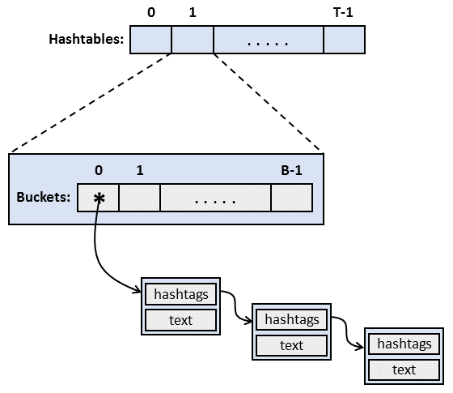
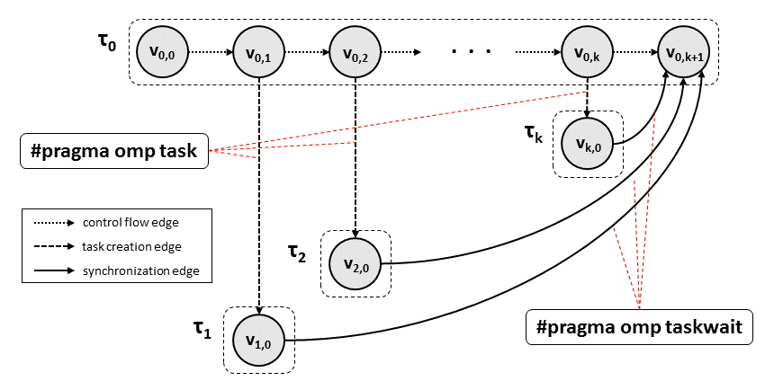

# OpenMP-Task-Suite
This suite is intended to provide a collection of applications that allows you to test the latest features of the OpenMP tasking implementations described in the latest versions of the OpenMP specification. In the rest of this README file are reported the minimal informations required to compile and run the relative application and a short description.

## Hashtag-Text Back-End Server
This program provides the implementation of a back-end server in charge of answering to simulated users requests for all those Texts held by the server itself and that are related to a particular Hashtag passed as input for the request. The server handles Hashtag-Text pairs as node items, each one connected into one of the several lists it actually maintains. In its turn, each list is associated to a particular bucket number and belongs to one of the several hashtables of which the server is equipped with. Further, each Text can be related to more than one Hashtag and the associated node may need to be connected to more than one list.

Since data is not replicated across the different hashtables, a request for all those Texts that are related to a given Hashtag mandatory needs to be propagated to all the hashtables before the server would be actually able to send a complete response to a user's request.
Despite the application can be compiled for sequential execution, we injected the proper OpenMP task directives into the code in order to exploit hardware parallelism offered by the target machine. More in detail, each simulated user request matches an OpenMP task which in turn generates as many tasks as there are hashtables, then it synchronizes with these tasks through a Taskwait directive since its output depends on the outputs of the latters.

Into the application folder you may find four files:

1. **hashtag-text-server.c** : contains the source code of the application including data structures and the initialization/finalization routines.

2. **hashtag-text-server.h** : this header file contains all the application's parameters set to the values of the default configuration. Each of these parameters can be changed to produce a different configuration:

    1. **STRINGS_HT_NUMBER** : indicates how many hashtable instances to use
    2. **STRINGS_HT_BUCKETS** : indicates how many buckets each hashtable is provided with
    3. **REQUESTS_NUMBER** : determines the total number of user requests arriving into the server
    4. **PRIORITY_X_PROBABILITY** : determines the probability value of having a request with priority X (3 priority levels are provided by default and the sum of their probability values must be always equal to 1.0)

3. **TextHashtag.txt** : this heavy file is read once in the initialization phase to populate data structures with Hashtag-Text pairs.

4. **Makefile** : used either to compile the application (with ***make***) or to clean object files (with ***make clean***). Furthermore, two flags (commented by default) may be uncommented to enable additional features:

    1. **POISSON_ARRIVAL_TIME** : when active provides an average time value (expressed in seconds) for a Poisson process distribution in order to simulate an exponential interarrival time between consecutive requests.
    
    2. **NEW_NODES_INSERTION** : when active enables some users requests (according to the given probability value) to be an insertion request, that is the associated task will perform the insertion of a new node into one list of one hashtable. To make it possible we rely on the *omp_lock_t* spinlocks, one per list, in order to ensure exclusive access to that list.

Additional informations about parameters, a brief descriptions of them and the range of admitted values are reported in the header file.
